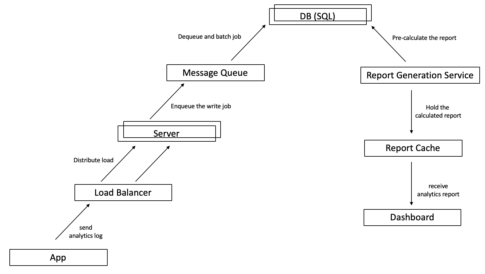

## A high-level design for a Google Analytics like backend system

### 1. What is Google Analytics?

Google Analytics collects, processes and reports data on how customers are using your app, so that you can get a deeper understanding of your users, develop new ideas for improvement, and evaluate the result of such actions.

Major features include,

- Embedded code snippets send a request to store log data.
- Aggregate the log data to provide insightful reports on app use.

### 2. Requirements & Assumptions

Requirements

- Handle large write volume: Billions write events per day.
- Handle large read/query volume: Millions merchants want to get insight about their business. Read/Query patterns are time-series related metrics.
- Provide metrics to customers with at most one hour delay.
- Run with minimum downtime.
- Have the ability to reprocess historical data in case of bugs in the processing logic.

Assumptions

- Start from supportting web apps.
- First collect page view events only.
- As a basic metric, the system may collect data such as timestamp, url, referrer, user_id, browser, and OS.
- Development time is constrained (since PayPay).
- Used by 100 thousand web apps.
- 100 requests per second per app on average. 10 million requests per second.
- 100 Bytes for 1 request log. 30 PetaBytes of data per year!

Out of Scope

- Support for [native apps](https://developers.google.com/analytics/devguides/collection/mobile/).
- Track further customer interactions such as [clicks and scrolls](https://developers.google.com/analytics/devguides/collection/gtagjs/events).
- Consider the unique goals of this system with the business team and identify metrics that should truely be measured.
- Select the front-end visualization stack. Go custom or use existing solutions such as [Google Data Studio](https://datastudio.google.com/) or [Tableau](https://www.tableau.com/).
- Counter measure threats such as DDOS atacks by rate limiting.
- Use machine learning to suggest insights from data such as which users are likely to convert by some action.

### 3. Initial Design

One of the most simplest design can be outlined as follows.


First, a snippet added to the app's page will send tracking information to the server via url params.

```
`http://logserver.com/ping?userId=${userId}&url=${url}`
```

Next, the server will extract the params and store it in a DB (let's say SQL).

```
@GetMapping("/ping")
void ping(@RequestParam(value = "userId") Long userId, @RequestParam(value = "url") String url) {
    Log log = new Log(userId, url)
    logRepository.save(log)
}
```

Finally, for example, if the dashboard request the number of hits by unique users in time-frame, the following SQL runs.

```
select count(distinct user_id) from ... where date>='2019-04-10' and date <='2019-04-18'
```

### 4. Key Issues

Although such simple design will "work," it clearly holds issues in terms of perfromance, scalability and reliability.

- First, a single server and DB will easily become overloaded with billions of (small) requests.

- Second, if that single server or DB fails, it will take down the whole system.

- Third, PetaBytes of records cannot be stored in a single DB.

- Forth, conducting SQL queries to billions of records on the fly is not performant.

### 5. Refined Design

Based on the issues identified above, the architecture has been refined as follows.



First, multiple instances of servers and DBs were added with load balancers to horizontally scale the system. DBs are both partitioned and replicated. The partitioning strategy should consider uneven loads between websites and time of the day. For example, peak shift can be done by separating apps that are near in terms of longitude.

Second, since writing to the database on every request is costly, a message queue is placed in between to temporarly hold and batch requests.

Third, a report generation service constantly precalculates reports and saves it in a cache rather than querying on the fly. For time-series data, most of the previous hour results can be reused by segmenting the report by hour and only calculating the latest 1 hour.

### 6. Further Considerations

To further improve the design, one idea is to stop using SQL altogether and design a data warehoue solution such as to store data as a simple log file and conduct MapReduce jobs.

However, considering the assumption that this system is designed in a resource-constrained fast-paced environment, developing such systems from ground up is likely too much overhead.

An alternative solution is to utilize cloud services such as AWS. AWS Lambda processes the request and saves it to S3. Redshift conducts the aggregation job and generates the report.


### 7. References

- [Google Analytics About](https://marketingplatform.google.com/about/analytics/)
- [Google Analytics Developer Guide](https://developers.google.com/analytics/)
- [Building Your Own User Analytics System In SQL by Periscope Data](https://www.periscopedata.com/blog/how-to-build-your-own-user-analytics-in-sql)
- [Building a Custom Tracking and Analytics Platform by Groupon](https://engineering.groupon.com/2014/misc/building-a-custom-tracking-and-analytics-platform-information-is-power/)
- [AWS Web Analytics Dashboard](https://github.com/statsbotco/cube.js/tree/master/examples/aws-web-analytics)
- [Designing Data-Intensive Applications: The Big Ideas Behind Reliable, Scalable, and Maintainable Systems](https://www.amazon.com/gp/product/1449373321/)
- [system-design-primer](https://github.com/donnemartin/system-design-primer)
